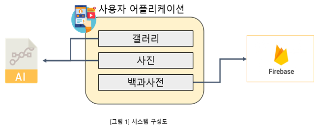

# 졸업 작품
머신러닝을 사용한 강아지 품종 인식 어플

## 특징
- 앨범에서 사진을 선택하거나 카메라를 통해 사진을 전송하여 AI를 이용해서 강아지 품종을 판단하고 그 결과를 제공
- 강아지 사진 데이터셋 3만장을 이용하여 Renset50(CNN)을 통해 학습하고 강아지 품종을 판단
- Google Firebase를 통해 강아지 품종에 대한 정보를 제공

## 시스템 구성도

## 서비스 시나리오

## 시퀀스 다이어그램

### 1. 사용자
갤러리나 카메라로 사진을 전송한다.
### 2. AI 서버
전송받은 사진으로 강아지 품종을 판단한다.

### 1. 사용자
갤러리나 카메라로 사진을 전송한다.
### 2. Google Firebase
강아지 품종 상세정보를 반환한다.

## 사용자 기능 요구사항
사용자의 기능에 대한 요구사항(User Functional Request)의 고유식별자 부여체계를 UFR.000으로 부여한다.  
| User Req ID | 내용 | 비고 |
|---|---|---|
| UFR.001 | 어플 실행 시 카메라와 저장소 권한을 설정할 수 있다. |  |
| UFR.002 | 메인화면에서 나의 갤러리 목록을 조회할 수 있다. |  |
| UFR.003 | 메인화면에서 카메라 기능을 사용할 수 있다. |  |
| UFR.004 | 메인화면에서 강아지 품종에 대한 정보를 볼 수 있다. |  |
| UFR.005 | 사진전송 후에 강아지 품종에 대한 결과가 나온다. |  |
| UFR.006 | 카메라에서 플래쉬와 화면전환 기능을 사용할 수 있다. |  |
| UFR.007 | 사진에 강아지가 없으면 강아지가 없음을 알 수 있다. |  |
| UFR.008 | 갤러리에서 사진 선택을 취소할 수 있다. |  |
| UFR.009 | 메인화면에서 갤러리, 사진, 백과사전을 선택할 수 있다. |  |

## 사용자 비기능 요구사항
| User Req ID | 내용 | 비고 |
|---|---|---|
| UFR.001 | 강아지 품종 판별을 빠르게 해야 한다. |  |
| UFR.002 | 데이터베이스 내용을 빠르게 로딩해야 한다. |  |

## 화면 설계서

1. 갤러리, 카메라, 사전을 선택할 수 있는 네비게이션 뷰이다.

## 기능 설계서

1. 모바일에서 사진을 촬영하거나 갤러리에서 사진을 선택한다.
2. 촬영되거나 갤러리에서 선택된 사진은 소켓을 통해서 AI 서버로 전송된다.
3. AI 서버는 사진을 이진파일로 받고 저장한다.
4. 받아진 사진에서 SSD 네트워크를 통해서 객체를 탐지한다.
5. 탐지된 객체가 하나의 사람, 강아지인지 체크한다. 사람, 강아지가 아니거나 여러 객체가 있을 경우 다시 사진을 입력하도록 한다.
6. 감지된 객체를 토대로 AI를 통해서 강아지 종을 예측한다.
7. 가장 확률이 높은 강이지 종 2종류가 나오고 각각의 확률에 대해서도 결과 값으로 나온다.(사람도 오락성을 위해서 예측된 종의 결과 값이 나온다.)
8. 종의 예측 값이 나오면 그 결과를 토대로 등록되어있는 사전으로 이동할 수 있다.
9. 총 124종, 각각의 종마다 약 120장씩 CNN인 Resnet50을 기반으로 학습한 AI 네트워크