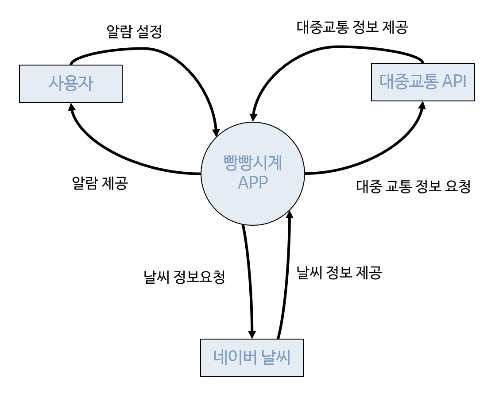
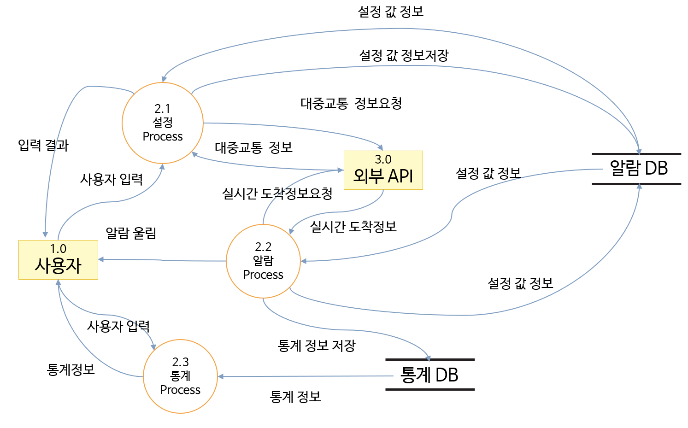
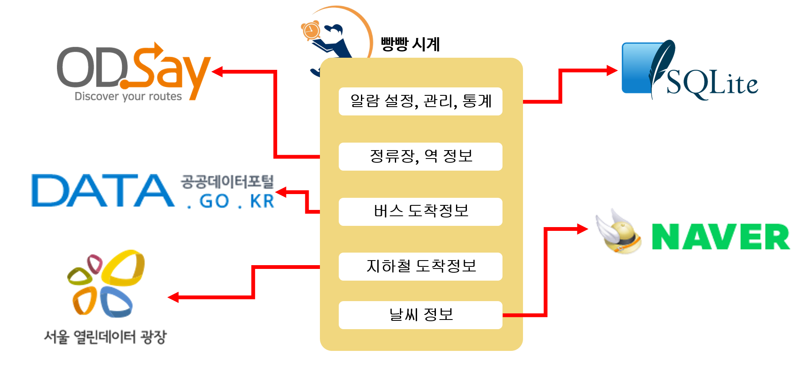
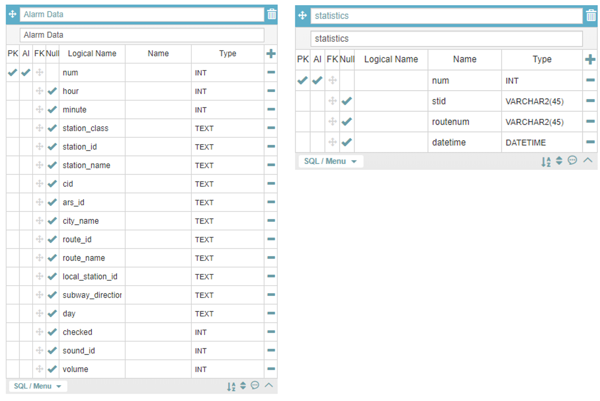
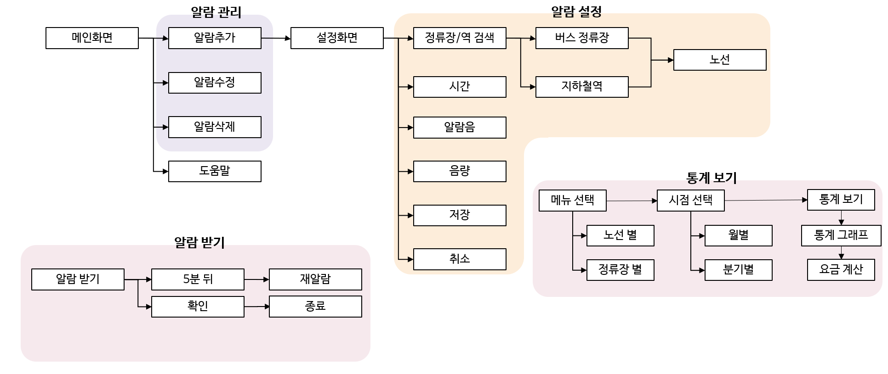
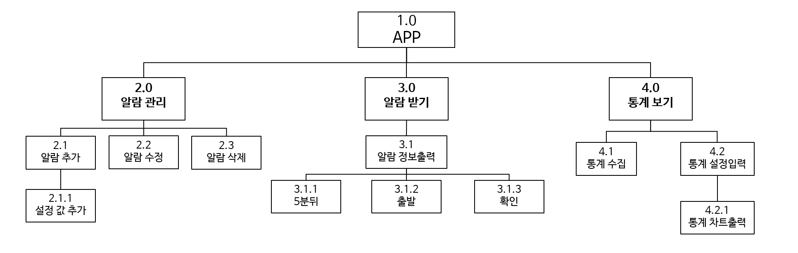
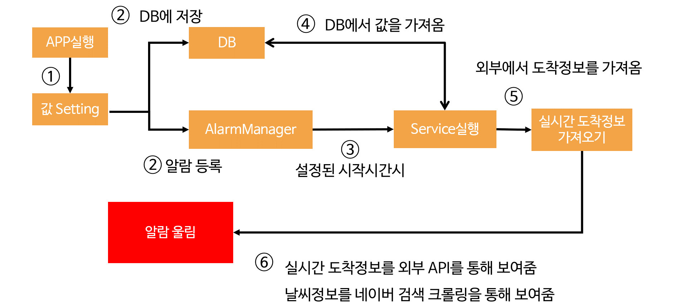

# P-project
대중교통 알람 서비스 어플

## 특징
- 대중교통 실시간 도착정보를 이용한 알람 서비스 제공
- 사용자가 설정한 정류장에 대한 날씨 정보 제공
- 사용자가 알람서비스를 이용한 정보를 통한 통계자료 제공

## 요구사항 분석
| 하위 시스템명 | 주요기능 |
|--|--|
| 정류장 및 노선정보 검색서비스 | 사용자의 정류장 선택에 대한 노선정보 제공 |
| 알람 설정 서비스 | 사용자의 요구에 따른 알람 설정 |
| 실시간 도착정보를 이용한 알람 서비스 | 사용자가 설정한 정류장과 노선정보에 따른 실시간 도착정보를 통한 알람 서비스 |
| 등록한 알람을 열람할 수 있는 서비스 | 사용자가 등록한 알람에 대한 정보 조회/수정/삭제 서비스 |
| 날씨정보를 이용한 정보제공 서비스 | 사용자가 설정한 정류장에 대한 날씨정보 제공 |
| 사용자 정보를 이용한 통계자료 제공 | 사용자가 알람 서비스를 이용한 정보를 통한 통계자료 제공 |

## 컨텍스트 다이어그램

## 자료 흐름도

## 시스템 구성도

## DB 구조

## 메뉴 구조도

## 구조 차트

## 모듈 개요도
| 모듈 번호 | 보충 설명 |
|--|--|
| 1.0 | 빵빵 시계 알람 어플 |
| 2.0 | 사용자 알람 관리 |
| 3.0 | 알람DB를 참조한 알람 울림 |
| 4.0 | 사용자의 이용정보를 통한 통계 |
| 2.1 | 정류장, 노선(지하철, 버스), 시간, 요일, 알람음, 음량 설정 값 추가 |
| 2.2 | 추가된 알람 설정 값 수정 |
| 2.3 | 추가된 알람 삭제 |
| 2.2.1 | 사용자 입력에 의한 설정 값 알람DB에 저장 |
| 3.1 | 사용자가 설정한 알람을 바탕으로 실시간 도착정보와 날씨정보를 출력 |
| 3.1.1 | 5분 뒤 설정 값을 바탕으로 재알람 실행 |
| 3.1.2 | 알람 종료, 통계자료 이용을 위한 통계DB에 저장 |
| 3.1.3 | 알람 종료 |
| 4.1 | 알람 작동 시 출발 버튼을 통한 자료 수집 |
| 4.2 | 통계자료를 보기위한 사용자의 입력 (노선, 정류장, 월별, 분기별) |
| 4.2.1 | 사용자 입력에 따른 통계자료 출력, 지출 계산기 |

## 알람기능 설계 알고리즘
