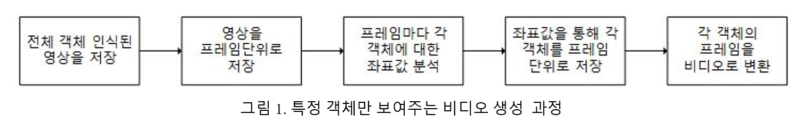
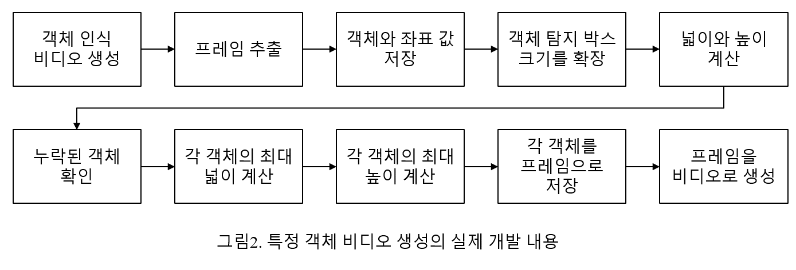

# 2019 1st semester Software Competition
영상안에서 특정 객체 영역만 추출하여 보여주는 프로그램

## 특징
- 각 객체만 보여주는 영상을 저장
- 서로 다른 분류의 객체에 대한 영상 재생 가능 
- 특정 키를 누르면 각 객체에 대한 영상이 새로 재생
- 영상이 새로 재생될 시 기존 영상은 일시 정지됨

## 개발 과정

